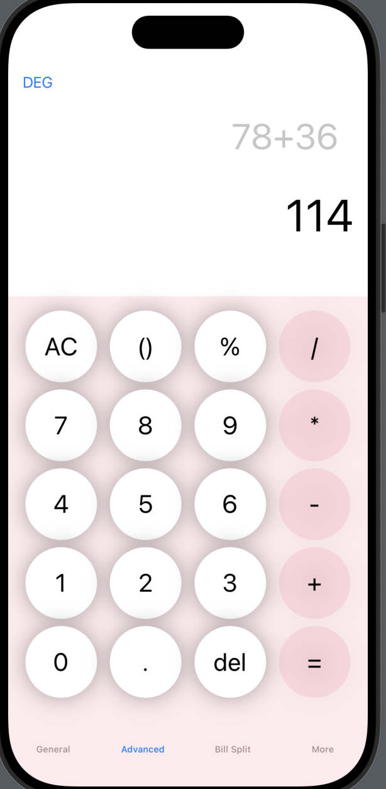

# CalculatorApp

A simple calculator app built with SwiftUI, featuring basic arithmetic operations and a clean, responsive user interface.

## Features

- Basic arithmetic operations: Addition, Subtraction, Multiplication, Division
- Support for clearing the screen (`AC`), deleting the last input (`del`), and evaluating results (`=`)
- Responsive layout using `LazyVGrid`
- Lightweight and efficient with dynamic button layout

## Technologies Used

- **SwiftUI**: For building the user interface
- **NSExpression**: For evaluating mathematical expressions
- **Swift**: For business logic and state management

## Screenshots




## Installation

1. Clone the repository:
   ```bash
   git clone https://github.com/yourusername/CalculatorApp.git

